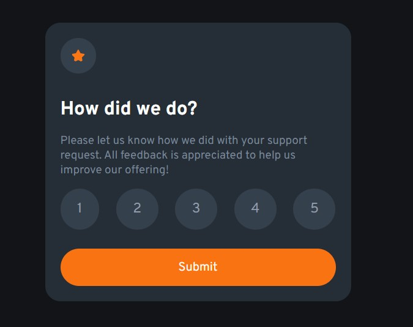
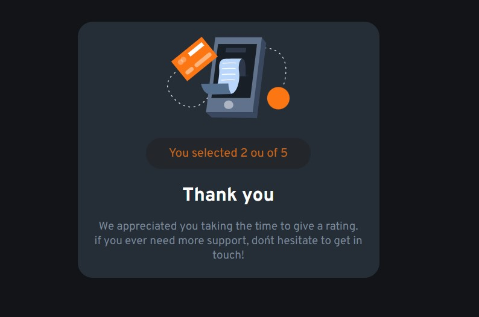

# INTERACTIVE RATING 
😎ESTE PROJETO É UM EXEMPLO DE COMPONENTE DE AVALIAÇÃO INTERATIVO CRIADO COM HTML, CSS E JAVASCRIPT.

  
  

## DESCRIÇÃO:
Este projeto é um exemplo de **componente de avaliação interativo** criado com **HTML**, **CSS** e **JavaScript**. Ele permite que os usuários forneçam uma nota de 1 a 5, e em seguida exibe uma mensagem de agradecimento personalizada com base na nota selecionada.

## COMPONENTES PRINCIPAIS:
1. **Interface de Avaliação:**
   - O componente de avaliação exibe uma estrela decorativa e uma pergunta: **"How did we do?"**.
   - Abaixo, há uma explicação solicitando que o usuário deixe seu feedback sobre o serviço ou produto.
   - Os usuários podem escolher uma nota de 1 a 5, clicando nos círculos numerados.

2. **Interatividade:**
   - O estilo visual inclui transições suaves, que destacam o número selecionado e o botão de envio. 
   - Quando um número é selecionado, o círculo ao redor do número muda de cor para laranja, sinalizando a escolha.
   - Após escolher a nota, o usuário pode clicar no botão **Submit** para enviar sua resposta.

3. **Agradecimento:**
   - Depois de clicar em **Submit**, a interface de avaliação é substituída por uma mensagem de agradecimento, junto com a nota que foi selecionada.
   - A animação de transição entre os estados de "Avaliação" e "Agradecimento" cria uma experiência fluida para o usuário.

4. **Funcionalidade com JavaScript:**
   - O **JavaScript** manipula a escolha do usuário e gerencia as transições de interface.
   - Ele exibe a mensagem de agradecimento apenas quando uma nota é selecionada. Se o usuário tentar enviar sem selecionar uma nota, um alerta é disparado solicitando que uma escolha seja feita.
   - O número escolhido é inserido dinamicamente na mensagem de agradecimento.

## NÃO SABE?
- Entendemos que para manipular arquivos em `HTML`, `CSS` e outras linguagens relacionadas, é necessário possuir conhecimento nessas áreas. Para auxiliar nesse aprendizado, oferecemos cursos gratuitos disponíveis:
* [CURSO DE HTML E CSS](https://github.com/VILHALVA/CURSO-DE-HTML-E-CSS)
* [CURSO DE JAVASCRIPT](https://github.com/VILHALVA/CURSO-DE-JAVASCRIPT)
* [CONFIRA MAIS CURSOS](https://github.com/VILHALVA?tab=repositories&q=+topic:CURSO)

## CREDITOS:
- [PROJETO CRIADO PELO "matheusmanuel"](https://github.com/matheusmanuel/Interactive-rating-component)
- [PROJETO EDITADO PELO VILHALVA](https://github.com/VILHALVA)

